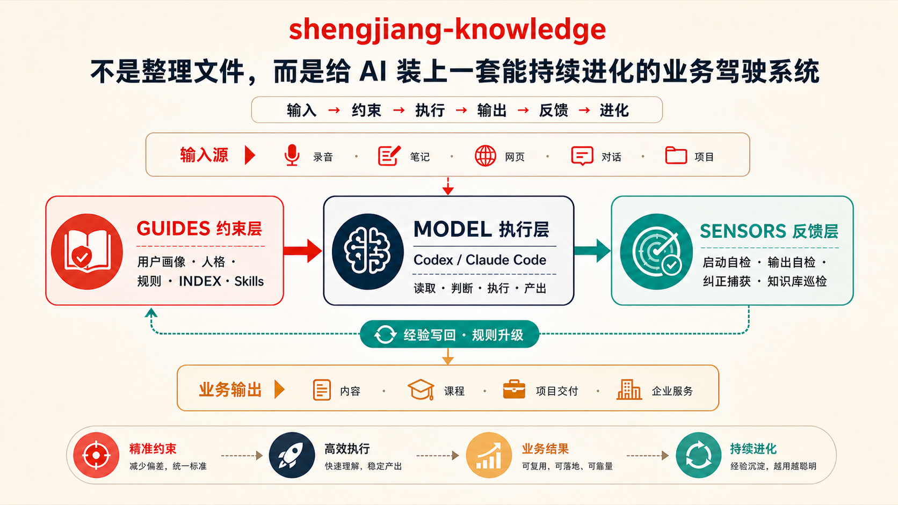

# Shengjiang Skills

余生姜在真实业务中持续使用、测试和迭代的开源 AI Skills。

系列统一使用 `shengjiang-*` 命名。这里不收集“看起来很厉害”的提示词；每个 Skill 都必须来自重复发生的真实任务，有明确输入、执行边界、输出结果和自动化验收。

## 系列目录

| Skill | 解决什么问题 | 状态 |
| --- | --- | --- |
| [`shengjiang-knowledge`](skills/shengjiang-knowledge/) | 下载后搭建个人 / 团队 / 自媒体系统知识库，接入已有资料，持续检查健康状态 | v0.4.0 |

## shengjiang-knowledge



> 你的文件不是知识库。只有当 AI 能稳定读到用户画像、当前工作、业务规则和原始事实，执行后还能接受检查、记录纠正并升级经验，它才是一套能运行的知识库。

它提供六个完整工作流：

| 模式 | 适合什么情况 | 它会做什么 |
| --- | --- | --- |
| 搭建 | 空目录或资料很少 | 建立入口、用户画像、规则、导航、当前工作、资料区、输出区、项目档案和健康状态层 |
| 自媒体模式 | 做自媒体、个人 IP 或内容生产 | 一键建立账号定位、对标调研、用户洞察、素材、选题、文稿流转、发布和数据复盘工作台 |
| 资料接入 | 有 PDF、Word、表格、录音、网页或旧文件夹 | 先扫描，再读取内容，区分外部观点、用户判断、业务事实和项目材料，确认后结构化写入 |
| 健康检查 | 担心知识库慢慢失效 | 检查入口、断链、版本冲突、收件箱积压、敏感文件和导航漂移，保存最新状态 |
| 修复 | 已经发现问题 | 给出路径级修改预览，确认后修复，再重新检查 |
| 自我纠错 | 用户指出错误或要求“别再犯” | 记录纠正并计数，同类满 3 次提议升级为固定规则，重要任务前先翻最近纠正 |

## 一条命令安装

适用于支持 [Skills CLI](https://www.npmjs.com/package/skills) 的 Agent 项目：

```bash
npx -y skills@latest add aslanyushengjiang-coder/shengjiang-skills \
  --skill shengjiang-knowledge \
  -y
```

也可以使用 GitHub CLI 安装：

```bash
# Codex
gh skill install aslanyushengjiang-coder/shengjiang-skills \
  shengjiang-knowledge \
  --agent codex \
  --scope user

# Claude Code
gh skill install aslanyushengjiang-coder/shengjiang-skills \
  shengjiang-knowledge \
  --agent claude-code \
  --scope user
```

安装后直接这样说：

```text
调用 shengjiang-knowledge，把这个空文件夹搭成我的系统知识库，先预览。
调用 shengjiang-knowledge，按自媒体模式搭建知识库，能管理对标、选题、文稿和发布数据，先预览。
调用 shengjiang-knowledge，读取这批资料，区分外部观点和我的判断，先给接入方案。
调用 shengjiang-knowledge，检查知识库健康状态并保存报告，不要自动修复。
调用 shengjiang-knowledge，根据巡检报告给修复预览，我确认后再改。
```

## 开源标准

- 来自真实、重复发生的工作；
- 默认只读，写入前给预览；
- 原始事实、外部观点、用户判断和 Agent 提炼明确分层；
- 有清晰边界、自动化测试和可验证结果；
- 用户纠正会回到规则与评测；
- 不把向量库、云端 RAG 或第三方同步冒充成本地现成功能。

## 作者

余生姜（GitHub: [@aslanyushengjiang-coder](https://github.com/aslanyushengjiang-coder)）

## License

[MIT](LICENSE)
