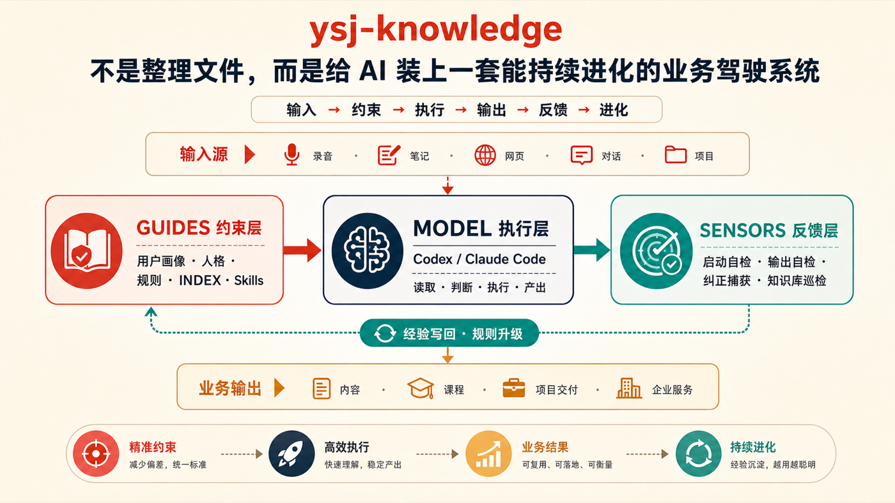

# yushengjiang-skills

余生姜在真实业务中持续使用、测试和迭代的 AI Skills。

这里不收集“看起来很厉害”的提示词。每个 Skill 都必须来自重复发生的真实任务，有明确输入、执行边界、输出结果和验收方法。

## 首个 Skill：`ysj-knowledge`



> 你的文件不是知识库。只有当 AI 能稳定读到用户画像、当前工作、业务规则和原始事实，执行后还能接受检查、记录纠正并升级经验，它才是一套能运行的知识库。

`ysj-knowledge` 解决的不是“文件放得整不整齐”，而是五个更实际的问题：

- 换一个会话，AI 又要从头认识你；
- 文件越来越多，AI 却找不到真正的事实源；
- “最终版 / 最新版”越积越多，回答开始互相冲突；
- 用户纠正过的问题，下次仍然再犯；
- 知识库搭完以后无人巡检，入口、索引和目录慢慢漂移。

它把本地文件夹接成一条可运行的 Harness 闭环：

```text
输入有归口
  → Guides 约束 AI 怎么理解和行动
  → Model 读取原始资料并执行业务任务
  → 输出进入内容、课程、项目交付或企业服务
  → Sensors 检查入口、断链、版本、积压与敏感文件
  → 用户纠正和执行经验写回规则，下一次做得更稳
```

### 一个 Skill，四种模式

| 模式 | 适合什么情况 | 它会做什么 |
| --- | --- | --- |
| 搭建 | 空目录或资料很少 | 建立最小入口、上下文、导航、当前工作和反馈层 |
| 接入 | 已经有很多资料 | 保留原目录，补入口、索引、事实源与版本规则 |
| 自检 | 担心知识库失效 | 只读检查入口、断链、版本冲突、积压和敏感文件 |
| 修复 | 已经发现问题 | 先给精确修改预览，确认后修复，再重新巡检 |

[查看完整说明与框架图](skills/ysj-knowledge/) · [查看 v0.1.0](https://github.com/aslanyushengjiang-coder/yushengjiang-skills/releases/tag/v0.1.0)

## 30 秒安装

GitHub CLI 2.96.0 及以上可以直接安装：

```bash
# Codex：安装到用户级，所有项目可用
gh skill install aslanyushengjiang-coder/yushengjiang-skills ysj-knowledge --agent codex --scope user

# Claude Code：安装到用户级，所有项目可用
gh skill install aslanyushengjiang-coder/yushengjiang-skills ysj-knowledge --agent claude-code --scope user
```

也可以手动把 Skill 文件夹复制到当前 Agent 的 skills 目录：

```text
Codex 项目：      .agents/skills/ysj-knowledge/
Claude Code 项目：.claude/skills/ysj-knowledge/
```

长期逻辑只维护一份。需要同时支持多个 Agent 时，让其他入口指向同一份 `SKILL.md`，不要复制出多份长期维护版本。

## 直接这样用

```text
/ysj-knowledge 帮我把这个文件夹搭成 AI 知识库，先审计，不要直接搬文件。
/ysj-knowledge 接入这个已有资料库，告诉我入口、事实源和版本冲突在哪里。
/ysj-knowledge 检查知识库有没有断链、多个最终版、积压或敏感文件风险。
/ysj-knowledge 根据巡检报告给修复预览，我确认后再改。
```

## 开源原则

- 来自真实、重复发生的工作；
- 输入和输出足够明确；
- 有边界、有验收、有测试；
- 用户纠正会回到规则与评测；
- 能被别人安装、使用和继续改进。

## 作者

余生姜（GitHub: [@aslanyushengjiang-coder](https://github.com/aslanyushengjiang-coder)）

## License

[MIT](LICENSE)
